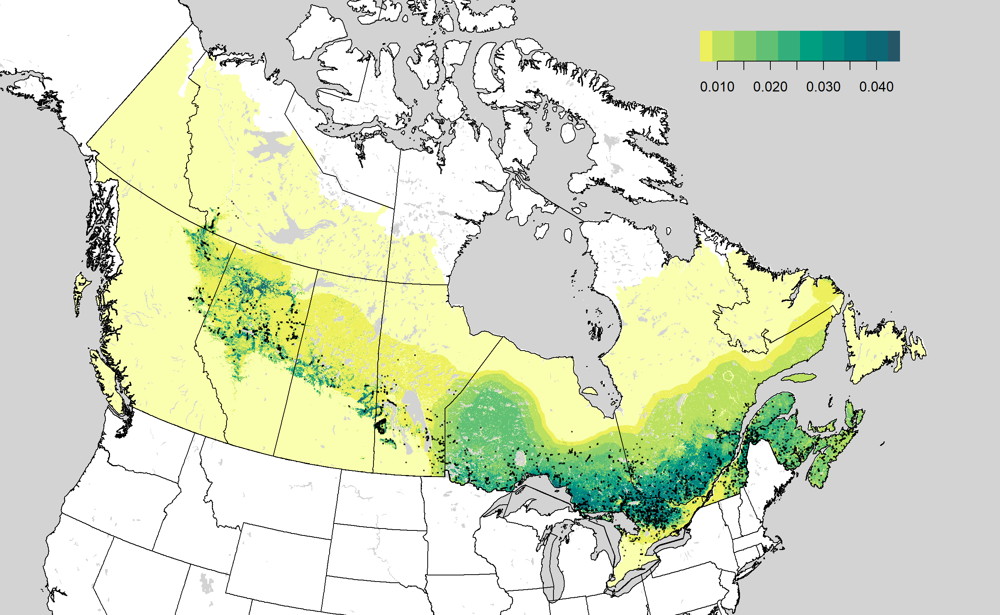

<p>&nbsp;</p>
<p>&nbsp;</p>

# BAMexploreR

## Overview

`BAMexploreR` is an R package is a package for downloading and analyzing landbird density models produced by the Boreal Avian Modelling Centre (BAM).

The BAM landbird density models are species-specific predictions of the density of breeding male birds per hectare at a 1km resolution across the boreal forest. They are produced with a generalized analytical approach to model landbird species density in relation to environmental predictors, using in-person or ARU point-count surveys and widely available spatial predictors. We developed separate models for each geographic region (bird conservation regions) based on predictors such as tree species biomass (local and landscape scale), forest age, topography, land use, and climate. We used machine learning to allow for predictor interactions and non-linear responses while avoiding time-consuming species-by-species parameterization. We applied cross-validation to avoid overfitting and bootstrap resampling to estimate uncertainty associated with our density estimates.


<p>&nbsp;</p>

Two versions of the BAM landbird density models are available in `BAMexploreR`. 

| Feature                                                             | BAM V4                                                | BAM V5                                                                 |
|---------------------------------------------------------------------|--------------------------------------------------------|------------------------------------------------------------------------|
| **Release year**                                                   | 2020                                                 | 2025 |
| **Species included**                                               | 143                                                  | 66 priority species (remaining in progress) |
| **Dataset size**                                                   | 0.3 million surveys                                  | 1.4 million surveys, including eBird |
| **Geographic extent**                                              | Canada only                                          | Canada (boreal and hemiboreal of US in progress) |
| **Temporal resolution**                                            | Predictions for 2017                                 | Predictions at five-year intervals from 1990 to 2020 |
| **Model subregions**                                           | Bird conservation region (BCR)          | Updated BCRs and country |
| **Environmental predictors**                                       | Landcover, biomass, climate                          | Time-matched predictors for vegetation biomass, human disturbance, and annual climate |
| **Model reliability information**                                  | Cross-validated model performance                    | Cross-validated model performance, map of coefficient of variation across bootstraps, map of model extrapolation, map of detection distribution |

## Installation

You can install the most recent stable version of `BAMexploreR` directly from this repository with:

``` r
# install.packages("remotes")
remotes::install_github("borealbirds/BAMexploreR")
```
You can install the most recent stable version and explore the vignettes in R with:

``` r
# install.packages("remotes")
remotes::install_github("borealbirds/BAMexploreR", build_vignettes=TRUE)
vignette(package="BAMexploreR")
```
To view a vignette, e.g. "BAMexploreR_1_intro" in the Help pane of RStudio run: 

```r
vignette("BAMexploreR_1_intro")
```

## Usage

There are three general categories of tasks that `BAMexploreR` provides:

- **1. Access Models** - download rasters of the model predictions and uncertainty for pre-set regions or custom areas of interest.
- **2. Distribution and Abundance** - explore bird species distribution and estimate population size using the downloaded rasters.
- **3. Habitat Relationships** - explore important predictors of boreal bird abundance and distribution.

You can find vignettes for each category as well as an introductory vignette within the package!

All functions begin with a `bam_*` prefix for ease of use. 

## Issues

To report bugs, request additional features, or get help using the package, please file an [issue](https://github.com/borealbirds/BAMexploreR/issues).

## Contributors

We encourage ongoing contributions and collaborations to improve the package into the future! Please issue a pull request if you'd like to contribute to the package.

## Citation

To cite `BAMexploreR` package and the BAM density models in publications, please cite the package and the publication:

Houle M, Boehm M, Wu S, Knight E (2025). BAMexploreR: model-based density, distribution, and habitat associations of boreal birds. R package version 0.1.0, https://github.com/borealbirds/BAMexploreR.

Stralberg D, Sólymos P, Docherty T, Crosby A, Van Wilgenburg S, Knight E, Drake A, Boehm M, Haché S, Leston L, Toms J, Ball J, Song S, Schmiegelow F, Cumming S, Bayne E (In press). “A generalized modeling framework for spatially extensive species abundance prediction and population estimation.” Ecosphere.
