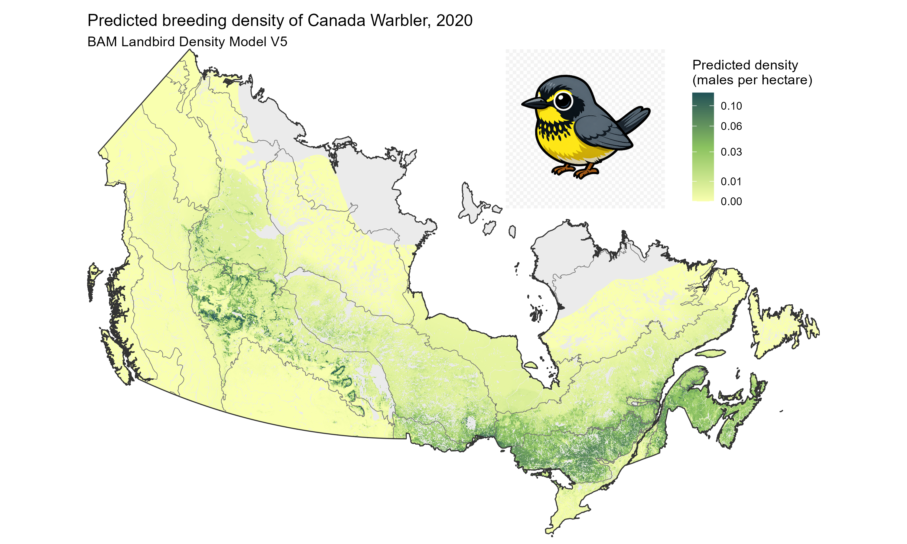

<p>&nbsp;</p>
<p>&nbsp;</p>

# BAMexploreR

## Overview

`BAMexploreR` is an R package for accessing and analyzing the Boreal Avian Modelling Centre's current and archived Landbird Density & Habitat models.

Other options for model access include:
- **1. [BAM model dashboard](https://cloud.borealbirds.ca/dashboard)** - visit the central landing page for our models, including species profiles from the models and more details about our modelling approach.
- **2. [BAMexploreR Shiny app](https://borealbirds.shinyapps.io/bam_landbird_viewer_dev95/)** - download and analyze model products with a graphical user interface.
- **3. [Google Earth Engine viewer](https://borealbirds-gee.projects.earthengine.app/view/landbirdmodels)** - view and explore predictions and uncertainty from the current Landbird Density & Habitat models over Google Earth imagery.
- **4. [BAM Geoportal](http://data.borealbirds.ca/srv/eng/catalog.search#/home)** - download the landbird models and BAM's other model products.

The BAM Landbird Density & Habitat models provide species-specific predictions of the density of breeding male birds per hectare at 1 km resolution across their respective modelled extents. The models use a generalized analytical approach to relate landbird density to environmental predictors using in-person and autonomous recording unit (ARU) point-count surveys. Separate models are fitted for ecological subregions using predictors such as tree-species biomass at local and landscape scales, forest age, topography, land use, and climate. Machine learning accommodates predictor interactions and nonlinear responses without requiring time-consuming species-by-species parameterization. Cross-validation is used to limit overfitting, and bootstrap resampling provides estimates of uncertainty in predicted density.


<p>&nbsp;</p>

Two releases of the Landbird Density & Habitat models are accessible through `BAMexploreR`: the archived models (Version 4) and the current models (Version 5).

| Feature                                                             | Archived models (Version 4)                           | Current models (Version 5)                                              |
|---------------------------------------------------------------------|--------------------------------------------------------|------------------------------------------------------------------------|
| **Release year**                                                   | 2020                                                 | 2026 |
| **Species included**                                               | 143                                                  | 149 |
| **Dataset size**                                                   | 0.3 million surveys                                  | 1.4 million surveys, including eBird |
| **Geographic extent**                                              | Canada only                                          | Canada, Alaska, Lower48 United States |
| **Temporal resolution**                                            | Predictions for 2017                                 | Public predictions for 2020; predictions at five-year intervals from 1995 to 2015 available by request (bamp@ualberta.ca)  |
| **Model subregions**                                           | Bird conservation region (BCR)          | Updated BCRs and country |
| **Environmental predictors**                                       | Landcover, biomass, climate                          | Time-matched predictors for vegetation biomass, human disturbance, and annual climate |
| **Model reliability information**                                  | Cross-validated model performance                    | Cross-validated model performance, Map of standard deviation and detection distance across bootstraps; maps of dataset distribution and extrapolation |

## Installation

You can install the most recent stable version of `BAMexploreR` directly from this repository with:

``` r
# install.packages("remotes")
remotes::install_github("borealbirds/BAMexploreR")
```
You can install the most recent stable version and explore the vignettes in R with:

``` r
# install.packages("remotes")
remotes::install_github("borealbirds/BAMexploreR", build_vignettes=TRUE)
vignette(package="BAMexploreR")
```
To view a vignette, e.g. "BAMexploreR_1_intro" in the Help pane of RStudio run: 

```r
vignette("BAMexploreR_1_intro")
```

## Usage

There are three general categories of tasks that `BAMexploreR` provides:

- **1. Access Models** - download rasters of the model predictions and uncertainty for pre-set regions or custom areas of interest.
- **2. Distribution and Abundance** - explore bird species distribution and estimate population size using the downloaded rasters.
- **3. Habitat Relationships** - explore important predictors of boreal bird abundance and distribution.

You can find vignettes for each category as well as an introductory vignette within the package!

All functions begin with a `bam_*` prefix for ease of use. 

## Issues

To report bugs, request additional features, or get help using the package, please file an [issue](https://github.com/borealbirds/BAMexploreR/issues).

## Contributors

We encourage ongoing contributions and collaborations to improve the package into the future! Please issue a pull request if you'd like to contribute to the package.

## Citation

To cite the `BAMexploreR` software, cite the R package:

Houle M, Boehm M, Wu S, Knight E (2025). BAMexploreR: model-based density, distribution, and habitat associations of boreal birds. R package version 0.1.0, https://github.com/borealbirds/BAMexploreR.

When reporting results from the BAM Landbird Density & Habitat models, cite the modelling framework:

Stralberg D, Sólymos P, Docherty T, Crosby A, Van Wilgenburg S, Knight E, Drake A, Boehm M, Haché S, Leston L, Toms J, Ball J, Song S, Schmiegelow F, Cumming S, Bayne E (2025). “A generalized modeling framework for spatially extensive species abundance prediction and population estimation.” [Ecosphere 16(10): e70405.](https://doi.org/10.1002/ecs2.70405)

Also cite the dataset corresponding to the model release used:

- **Current models (Version 5):** Knight EC, Drake A, Houle M, Thompson P, Stralberg D (2026). *BAM Landbird Density & Habitat Models (Version 5.0)* [Data set]. Zenodo. [https://doi.org/10.5281/zenodo/21632211](https://doi.org/10.5281/zenodo/21632211)
- **Archived models (Version 4):** Sólymos P, Stralberg D, Knight EC (2025). *BAM Generalized National Models Documentation (Version 4.0)* [Data set]. Zenodo. [https://doi.org/10.5281/zenodo.4018335](https://doi.org/10.5281/zenodo.4018335)
